# Seam sequence review

These diagrams test contract composition. Boxes named `Core …` are orchestration only: they hold no provider logic and every external, policy, retrieval, delivery, or durable asynchronous interaction crosses a named seam. No channel, connector, or job reaches an implementation provider directly.

## 1. SSO login

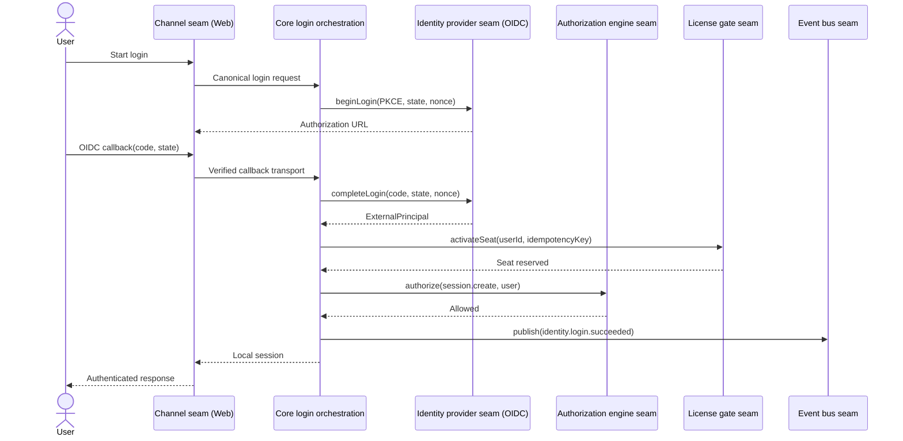

Failure check: invalid IdP proof creates no user session; seat or authorization denial emits a sanitized failure event and fails closed.

## 2. Web chat through redaction, guardrail, and metering

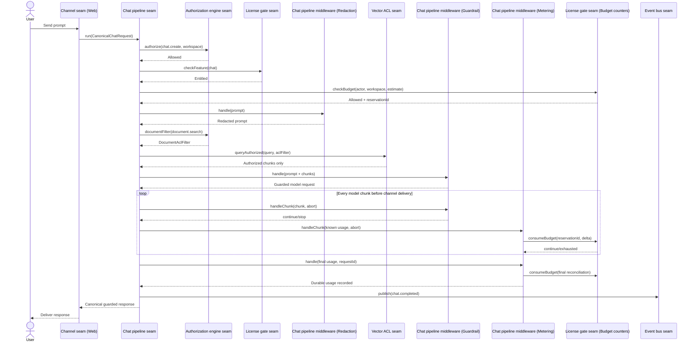

Failure check: redaction, ACL, guardrail, or metering failure stops delivery; streaming output crosses output guardrail before channel delivery.

## 3. Lark bot query

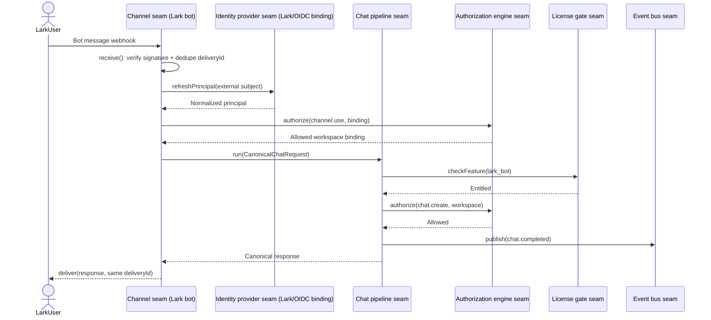

Failure check: delivery retry reuses stored canonical response; it never reruns pipeline or bills twice.

## 4. Connector sync with ACL mapping

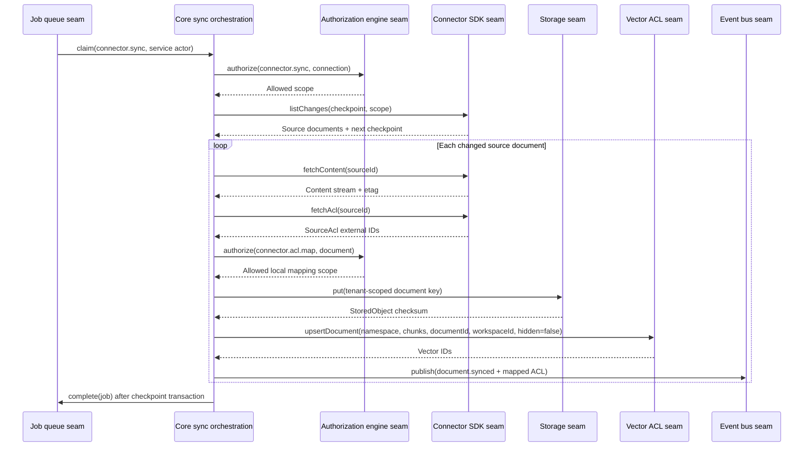

Failure check: unknown ACL principal maps to no access. Checkpoint advances only after content, local ACL, vectors, and outbox state are durable.

## 5. Organization document search with ACL filter

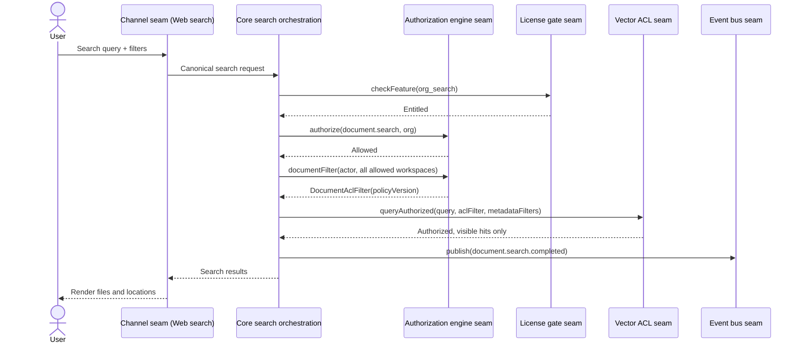

Failure check: missing/unsupported ACL filter produces no search. Admin identity gets no implicit bypass.

## 6. Retention purge job

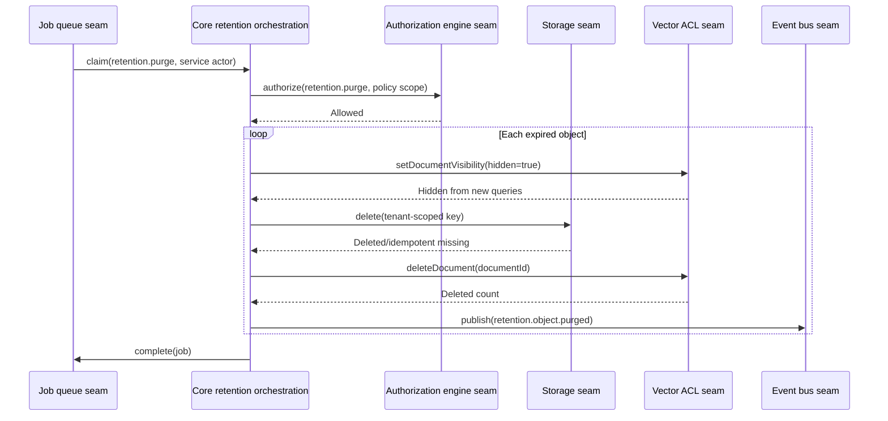

Failure check: hide happens before physical deletion. Crash may replay; storage/vector deletes and event IDs are idempotent.

## 7. License seat check and activation

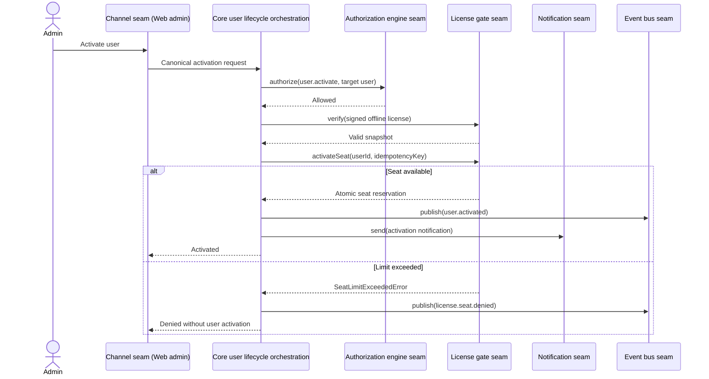

Failure check: concurrent activation cannot exceed signed seat limit; offline verification never calls home.

## 8. Audit event flow

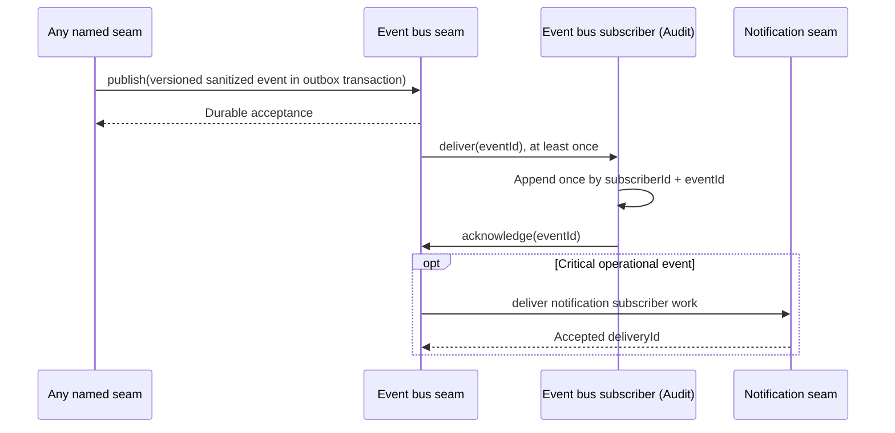

Failure check: subscriber failure retries/dead-letters independently; business mutation and audit event cannot commit separately.

## 9. Offboarding and ownership transfer

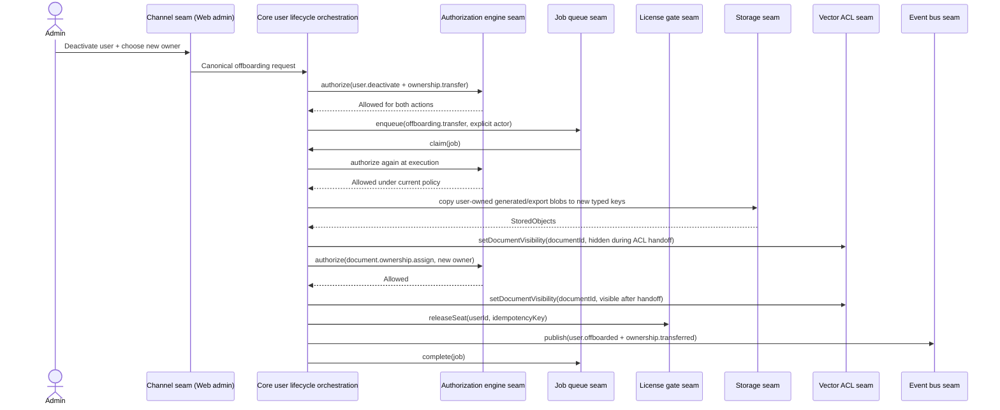

Failure check: source ownership remains until destination copy and metadata/ACL transfer commit; failed job retries without freeing seat early or exposing document mid-handoff.

## 10. Emergency content hide

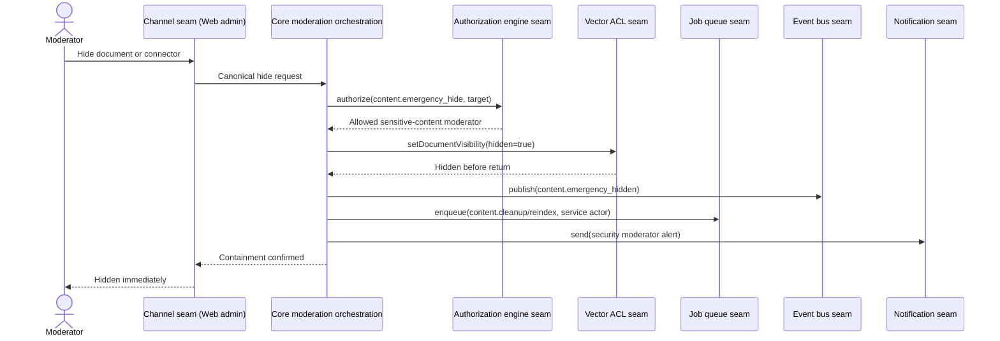

Failure check: success is returned only after new vector queries exclude target. Cleanup/reindex is asynchronous and cannot re-enable visibility.

## 11. Lark directory sync and auto-deactivation

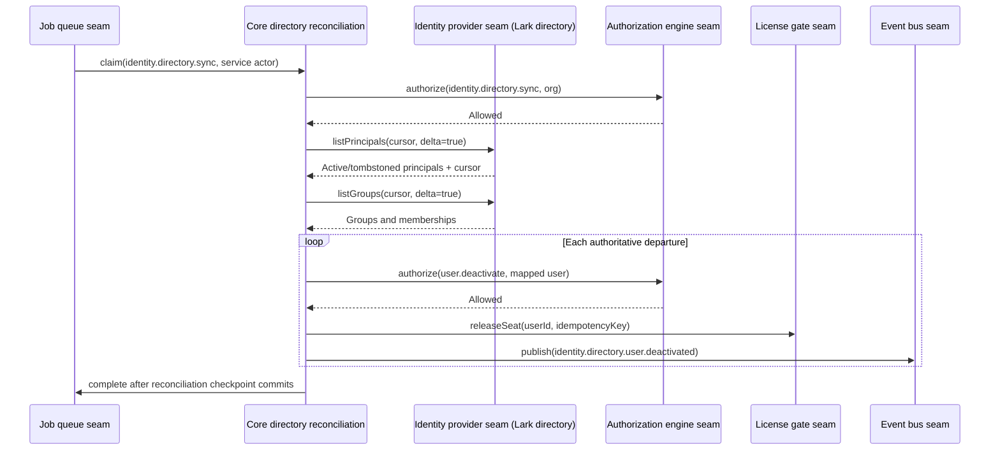

Failure check: partial enumeration never means departure. Only tombstone or completed authoritative full snapshot deactivates; OIDC-only capability flags prevent fake login-driven sync.

## 12. Connector ACL revocation propagation

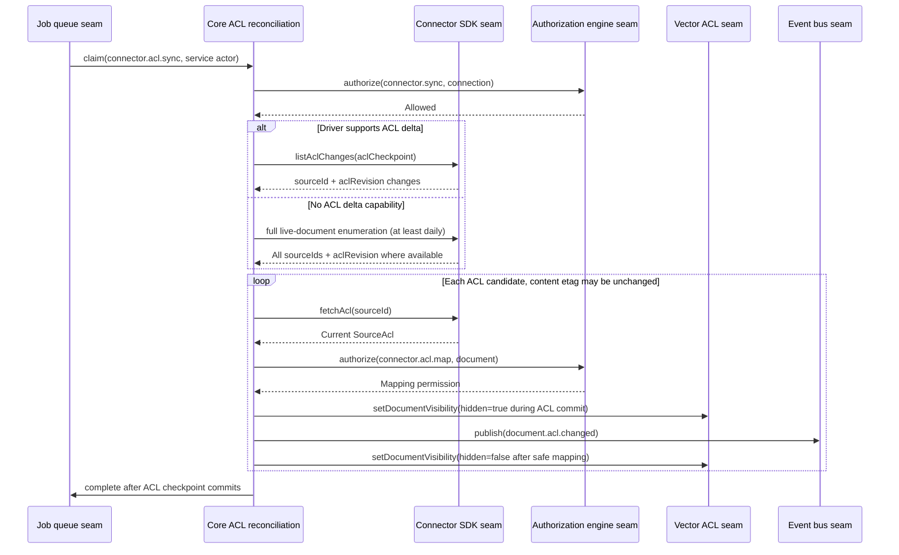

Failure check: permission removal need not change content etag. Mapping/fetch failure leaves target hidden; stale grants never remain fallback.

## 13. Embed widget query

```mermaid
sequenceDiagram
  actor Visitor as Anonymous visitor
  participant Embed as Channel seam (Embed widget)
  participant Pipeline as Chat pipeline seam
  participant Authz as Authorization engine seam
  participant License as License gate seam
  participant Vector as Vector ACL seam
  participant Events as Event bus seam
  Visitor->>Embed: Prompt + scoped embed key
  Embed->>Embed: Verify key; normalize embed actor
  Embed->>Pipeline: run(request with actor.type=embed)
  Pipeline->>License: checkFeature(embed_widget)
  License-->>Pipeline: Entitled; no seat consumed
  Pipeline->>License: checkBudget(embed-key + workspace + global)
  License-->>Pipeline: Allowed + reservation
  Pipeline->>Authz: authorize(chat.create, key-scoped workspace)
  Authz-->>Pipeline: Allowed only within key claims
  Pipeline->>Authz: documentFilter(embed actor)
  Authz-->>Pipeline: Attribute/bounded-key ACL filter, no groups
  Pipeline->>Vector: queryAuthorized(namespaces, aclFilter)
  Vector-->>Pipeline: Key-scoped authorized chunks
  Pipeline->>Events: publish(chat.completed, embed actor + scopedKeyId)
  Pipeline-->>Embed: Guarded metered response
  Embed-->>Visitor: Deliver
```

Failure check: URL/body scope can only narrow signed key claims. Missing scope yields `matchNone`; anonymous actor inherits no user/group access and consumes no seat.

## 14. View-as-user read and audit

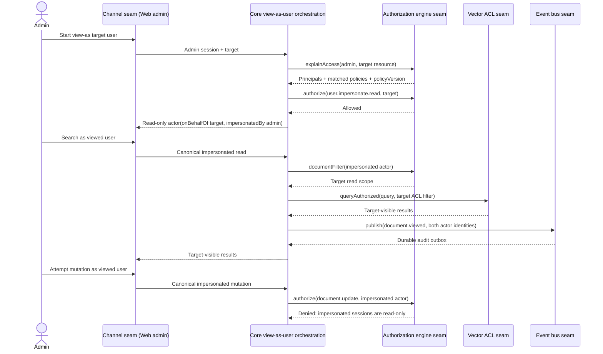

Failure check: audit indexes effective target and real administrator. Channel, job, and event envelopes cannot strip provenance; all mutations deny.

## 15. Budget exhaustion during stream

```mermaid
sequenceDiagram
  actor User
  participant Web as Channel seam (Web)
  participant Pipeline as Chat pipeline seam
  participant Guard as Chat middleware (Output guardrail)
  participant Meter as Chat middleware (Usage metering)
  participant Budget as License gate seam (Budget counters)
  participant Events as Event bus seam
  User->>Web: Long/deep-research prompt
  Web->>Pipeline: run(request)
  Pipeline->>Budget: checkBudget(strictest scopes, estimate)
  Budget-->>Pipeline: Allowed + reservationId
  loop Every model chunk
    Pipeline->>Guard: handleChunk(chunk, abort)
    Guard-->>Pipeline: continue
    Pipeline->>Meter: handleChunk(usage delta, abort)
    Meter->>Budget: consumeBudget(delta, idempotencyKey)
    alt Budget remains
      Budget-->>Meter: allowed=true
      Meter-->>Pipeline: continue
      Pipeline-->>Web: Guarded chunk
    else Ceiling reached
      Budget-->>Meter: allowed=false + exhausted scope
      Meter-->>Pipeline: stop
      Pipeline->>Pipeline: abort(reason) provider controller
      Pipeline->>Budget: consumeBudget(final known usage)
      Pipeline->>Events: publish(chat.aborted.budget)
      Pipeline-->>Web: Terminal budget response; no more chunks
    end
  end
```

Failure check: atomic counters prevent concurrent overspend. Counter-store failure or stop verdict aborts provider and channel delivery; known usage remains charged.

## Review result

All fifteen use cases cross named seams for provider I/O, policy decisions, chat execution, retrieval, durable asynchronous work, events, notifications, licensing/budgets, and blob access. QA-driven review added explicit directory sync, ACL-only change propagation, anonymous embed identity, immutable impersonation provenance, reverse access diagnostics, and chunk-level budget/guardrail abort behavior.
