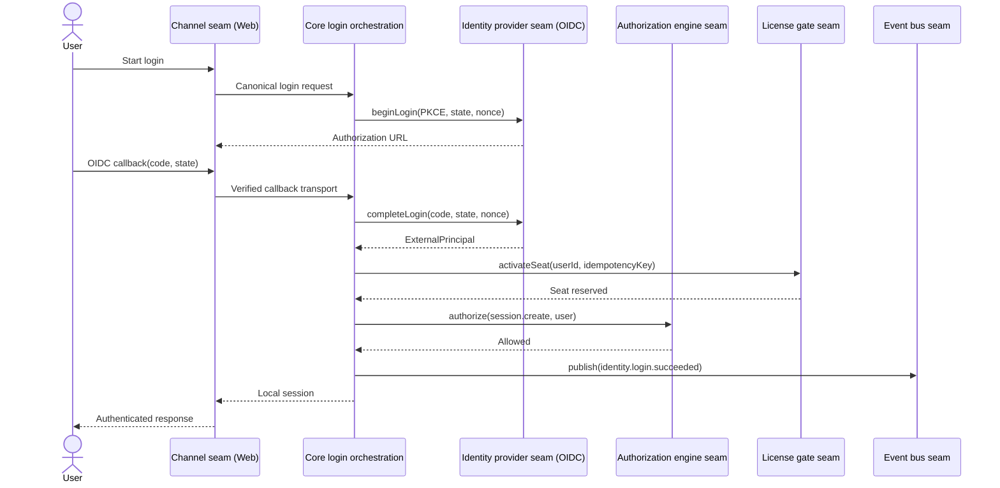
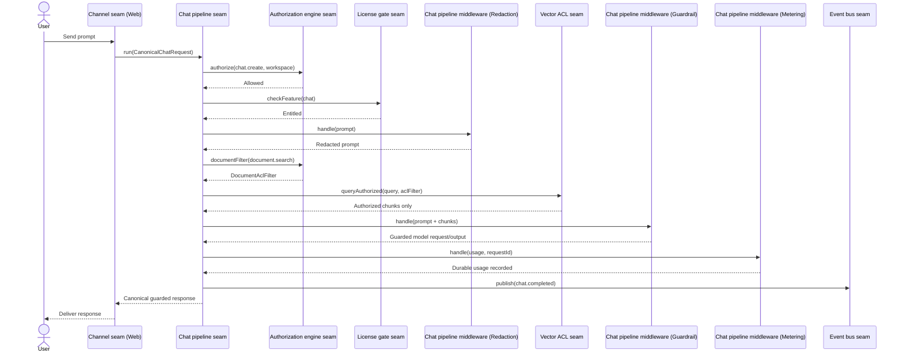
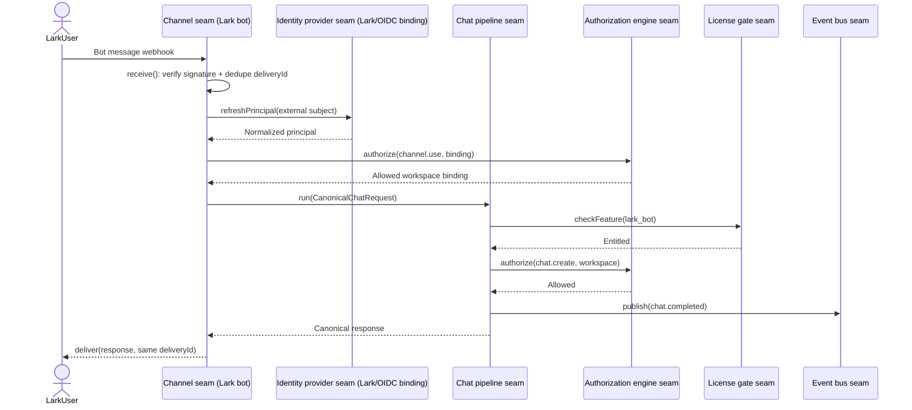
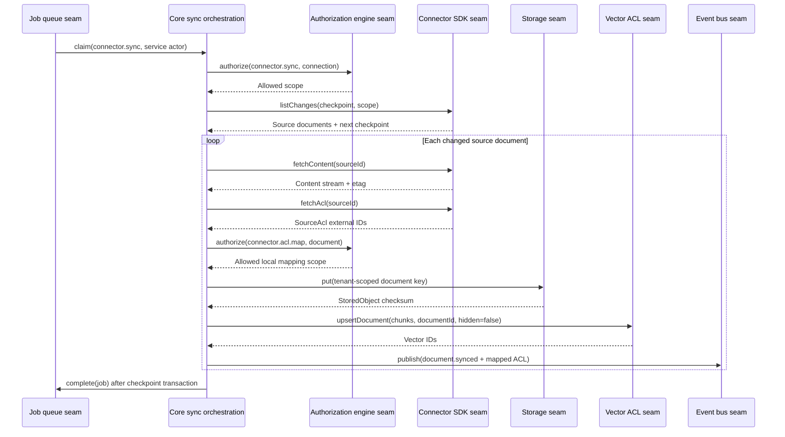
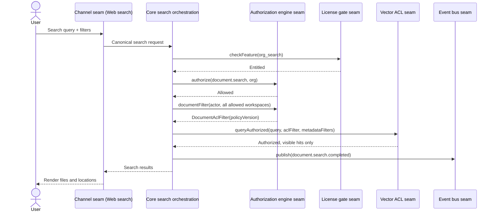
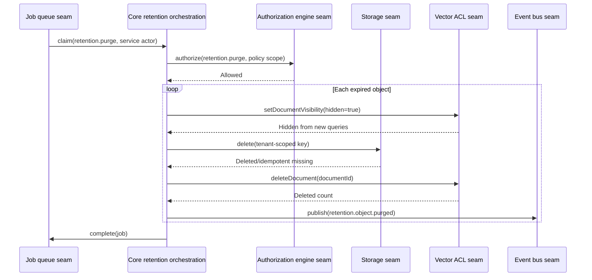
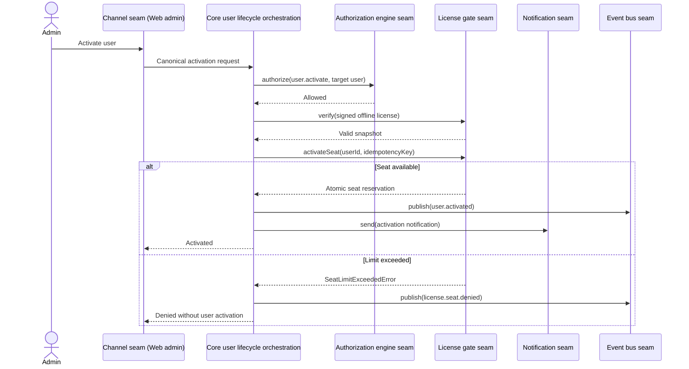
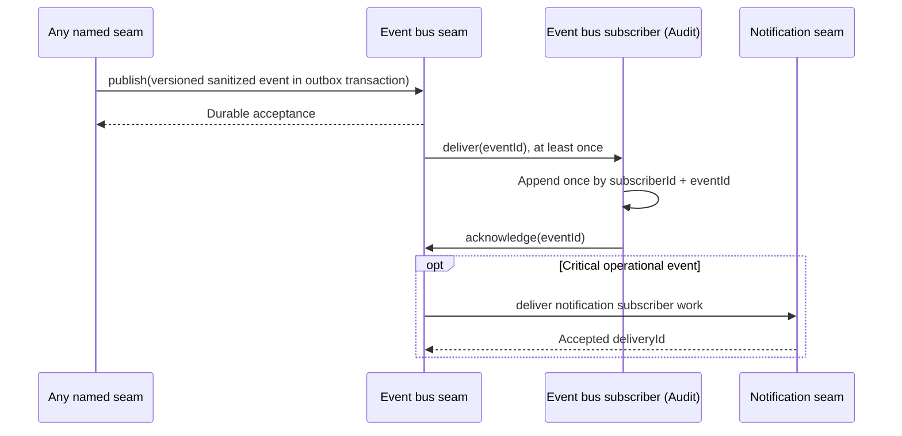
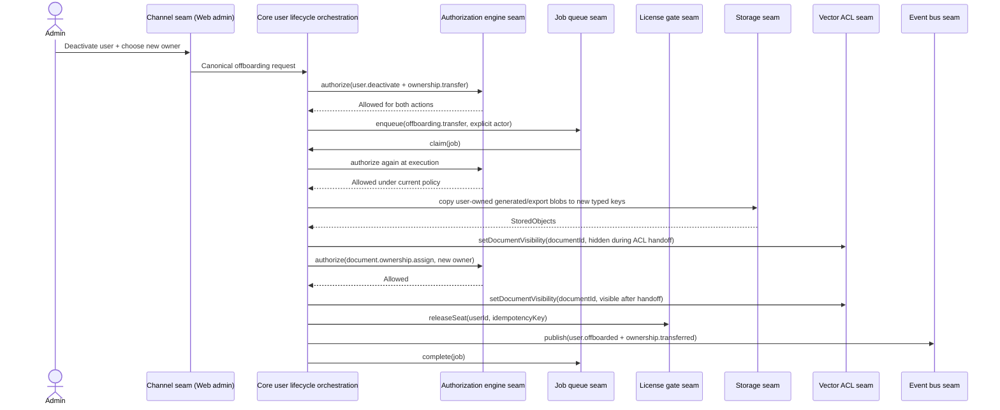
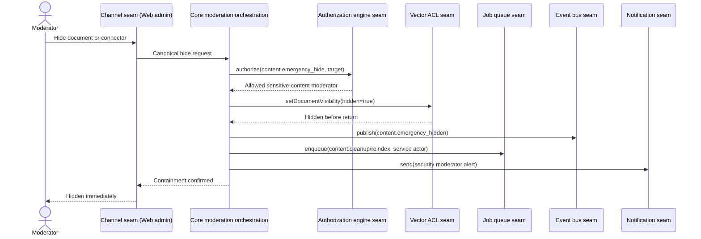

# Seam sequence review

These diagrams test contract composition. Boxes named `Core …` are orchestration only: they hold no provider logic and every external, policy, retrieval, delivery, or durable asynchronous interaction crosses a named seam. No channel, connector, or job reaches an implementation provider directly.

## 1. SSO login

Failure check: invalid IdP proof creates no user session; seat or authorization denial emits a sanitized failure event and fails closed.

## 2. Web chat through redaction, guardrail, and metering

Failure check: redaction, ACL, guardrail, or metering failure stops delivery; streaming output crosses output guardrail before channel delivery.

## 3. Lark bot query

Failure check: delivery retry reuses stored canonical response; it never reruns pipeline or bills twice.

## 4. Connector sync with ACL mapping

Failure check: unknown ACL principal maps to no access. Checkpoint advances only after content, local ACL, vectors, and outbox state are durable.

## 5. Organization document search with ACL filter

Failure check: missing/unsupported ACL filter produces no search. Admin identity gets no implicit bypass.

## 6. Retention purge job

Failure check: hide happens before physical deletion. Crash may replay; storage/vector deletes and event IDs are idempotent.

## 7. License seat check and activation

Failure check: concurrent activation cannot exceed signed seat limit; offline verification never calls home.

## 8. Audit event flow

Failure check: subscriber failure retries/dead-letters independently; business mutation and audit event cannot commit separately.

## 9. Offboarding and ownership transfer

Failure check: source ownership remains until destination copy and metadata/ACL transfer commit; failed job retries without freeing seat early or exposing document mid-handoff.

## 10. Emergency content hide

Failure check: success is returned only after new vector queries exclude target. Cleanup/reindex is asynchronous and cannot re-enable visibility.

## Review result

All ten use cases cross named seams for provider I/O, policy decisions, chat execution, retrieval, durable asynchronous work, events, notifications, licensing, and blob access. Contracts needed three explicit composition rules found while drawing: channel delivery retries do not rerun chat; connector checkpoints wait for ACL/index durability; emergency hide is synchronous at vector query layer.
